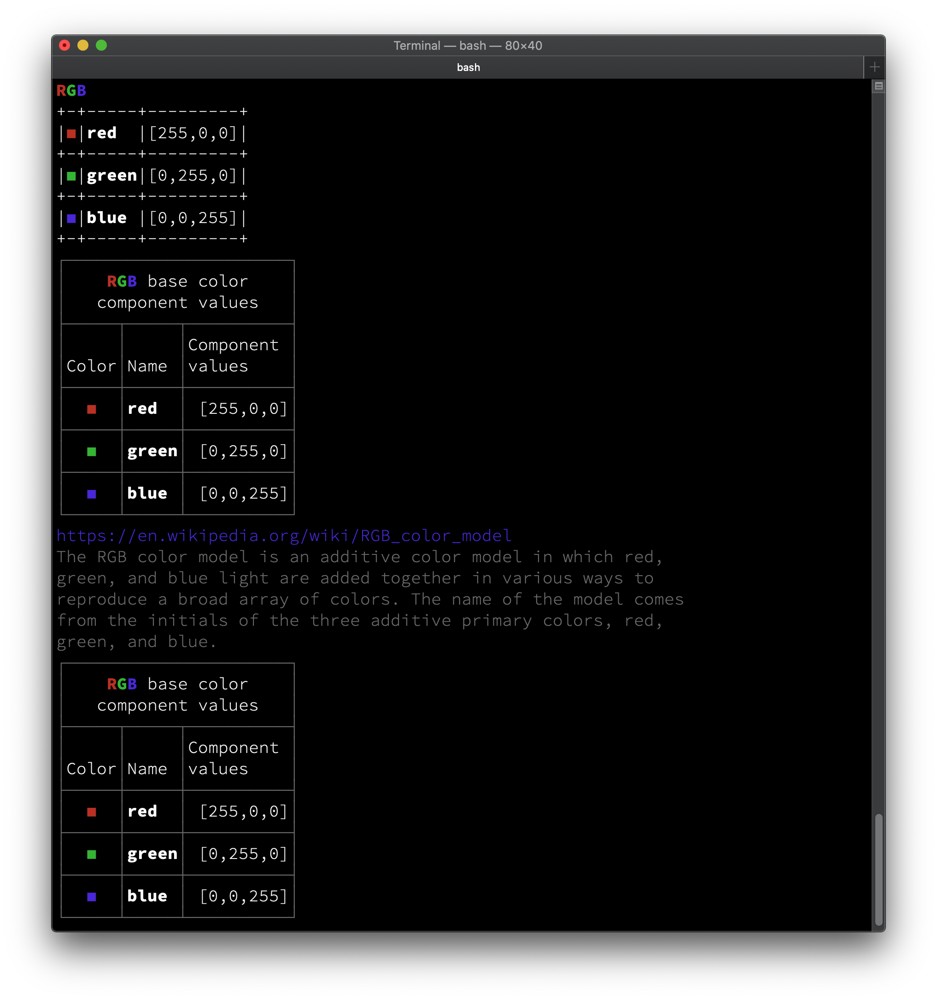

# AttributedText

This package provides basic constructs to generate attributed text and simple layouts for terminal output.

#### Example(s)
Run following example code snippets with Swift's REPL (on a terminal capable of interpreting ANSI escape sequences).

```
git clone https://github.com/gallinapassus/AttributedText
cd AttributedText
swift run --repl
```
Copy/paste the example code into REPL to see formatted output.
#### Example 1 - Formatted text

```swift
import AttributedText

typealias Text = AttributedText<DefaultAttributes>
let rgb = Text("R", .bold, .fgColor(.red)) +
    Text("G", .bold, .fgColor(.green)) +
    Text("B", .bold, .fgColor(.blue))
print(rgb.render())
// -> RGB (colored text)
```
NOTE: Github README.md markdown doesn't properly support coloring of text, hence output examples (below) will be missing colors.

Example 1 output:
<pre>
<b>RGB</b>
</pre>

#### Example 2 - Simple formatted table

```swift
typealias Table = AttributedTable<DefaultAttributes>
let source:[[Text]] = [
    [Text("◼︎", .fgColor(.red)),   Text("red", .bold),   Text("[255,0,0]")],
    [Text("◼︎", .fgColor(.green)), Text("green", .bold), Text("[0,255,0]")],
    [Text("◼︎", .fgColor(.blue)),  Text("blue", .bold),  Text("[0,0,255]")],
]
let ascii_table = Table(table: source)
print(ascii_table.render())
// -> Colorful table with default ascii character frame
```

Example 2 output (colors missing):
<pre>
+-+-----+---------+
|◼︎|<b>red</b>  |[255,0,0]|
+-+-----+---------+
|◼︎|<b>green</b>|[0,255,0]|
+-+-----+---------+
|◼︎|<b>blue</b> |[0,0,255]|
+-+-----+---------+
</pre>
#### Example 3 - Fancy table with title, headers, alignment & word wrapping
```swift
let columns:[Table.Column<DefaultAttributes>] = [
    Table.Column(Table.Header("Color", alignment: .bottomCenter, wrapping: .word), alignment: .middleCenter),
    Table.Column(Table.Header("Name", alignment: .bottomLeft)),
    Table.Column("Component values", width: 10, alignment: .middleRight)
]
let title = Table.Title(rgb + " base color component values", alignment: .middleCenter, wrapping: .word)
let fancy_table = Table(table: source,
                        title: title,
                        columns: columns,
                        frameElements: .lightDimmed,
                        frameRenderingOptions: .all)
print(fancy_table.render())
// -> Fancy table with title, headers, alignment & word wrapping
```

Example 3 output (colors missing):

<pre>
┌──────────────────────┐
│    <b>RGB</b> base color    │
│   component values   │
├─────┬─────┬──────────┤
│     │     │Component │
│Color│Name │values    │
├─────┼─────┼──────────┤
│  ◼︎  │<b>red</b>  │ [255,0,0]│
├─────┼─────┼──────────┤
│  ◼︎  │<b>green</b>│ [0,255,0]│
├─────┼─────┼──────────┤
│  ◼︎  │<b>blue</b> │ [0,0,255]│
└─────┴─────┴──────────┘
</pre>
#### Example 4 - Document with text & table
```swift
typealias Document = AttributedDocument<DefaultAttributes>
let wiki = Text("The RGB color model is an additive color model in which red, green, and blue light are added together in various ways to reproduce a broad array of colors. The name of the model comes from the initials of the three additive primary colors, red, green, and blue.", .dim)
let doc = Document(Text("https://en.wikipedia.org/wiki/RGB_color_model", .fgColor(.blue)))
doc.append(attributed: wiki, width: 64, wrapping: .word)
    .append(fancy_table)
print(doc.render())
// -> Wikipedia intro + fancy table
```
Example 4 output (colors missing):
<pre>
<u>https://en.wikipedia.org/wiki/RGB_color_model</u>
The RGB color model is an additive color model in which red,    
green, and blue light are added together in various ways to     
reproduce a broad array of colors. The name of the model comes  
from the initials of the three additive primary colors, red,    
green, and blue.                                                
┌──────────────────────┐
│    <b>RGB</b> base color    │
│   component values   │
├─────┬─────┬──────────┤
│     │     │Component │
│Color│Name │values    │
├─────┼─────┼──────────┤
│  ◼︎  │<b>red</b>  │ [255,0,0]│
├─────┼─────┼──────────┤
│  ◼︎  │<b>green</b>│ [0,255,0]│
├─────┼─────┼──────────┤
│  ◼︎  │<b>blue</b> │ [0,0,255]│
└─────┴─────┴──────────┘
</pre>
### Example output on terminal


## Versioning

```AttributedText``` package follows semantic versioning scheme https://semver.org/spec/v2.0.0.html. Current version is still at major version 0 (zero), which means "initial development". Anything may change at any time and the public API should not be considered stable.

## Features
    
#### AttributedText
##### Conforms to
- ```ExpressibleByStringLiteral```
- ```ExpressibleByArrayLiteral```
- ```Equatable```
- ```Collection```
- ```BidirectionalCollection```
- ```RangeReplaceableCollection```
- ```TextOutputStreamable```
- ```Rendable```

##### Features
- Coloring text foreground & background
    - 16 base colors (8 standard- and 8 high intensity colors of black, red, green, yellow, blue, magenta, cyan, white)
    - 216 additional indexed colors
    - 8 grayscale colors
    - See more https://en.wikipedia.org/wiki/ANSI_escape_code
- Text attributes; bold, dim, italic, underlined, blink, inverse, hidden, strikethrough
- Combining attributes
    - When two or more AttributedText instances are combined - also the attributes are combined (if possible).

*Please note that your terminal app may, or may not, support some of the above mentioned colors & traits.*

- Attribute customisation
    - By default, ```AttributedText``` uses it's own internal implementation for generating the attributed output (```DefaultAttributes```), but it can be completely replaced with custom implementation if needed
    - Custom attribute implementation must conform to following AttributeProtocol

```swift
public protocol AttributeProtocol : Equatable {
    static func render(_ attributed:AttributedText<Self>) -> String
}
```

#### AttributedTable
##### Conforms to
- ```TextOutputStreamable```
- ```Rendable```

##### Features
- Table title
- Column width / automatic column width calculation
- Column headers
- Horizontal & vertical text alignment for columns (or individual cells)
- Word wrapping options for columns (or individual cells)
    - Ability to customise (=extend) the word wrapping implementation
- Automatic row numbering
- Ability to customise the table frame drawing
    - Predefined set of ascii-art table frames (frames can be attributed as well)
    - Options to control which parts of the table frame are drawn
- Easy initialization from two dimensional array
- Newline handling
- Proper attribute handling for multi-line cells
- Hiding columns
- Customization
    - Default attributes ```DefaultAttributes``` can be replaced with custom implementation. For example DefaultAttributes can be replaced with your favourite Swift attributed text package and implement a specific renderer for it
    - Default renderer ```DefaultRenderer``` can be replaced with custom implementation
    - Section header/footer
    - Ability to extend default table frames with custom frame implementations
    - Ability to extend default word wrapping with custom implementations
    - Ability to control individual table cell properties
    - Depends on Swift stdlib only, no Foundation or other package dependencies

#### AttributedDocument
##### Conforms to
- ```Collection```
- ```RandomAccessCollection```
- ```BidirectionalCollection```
- ```RangeReplaceableCollection```
- ```TextOutputStreamable```
- ```Rendable```

##### Features
- Sections
- Text
- Tables

## Limitations
- In general, doesn't support mixing multiple different ```Attributes``` within a single document. Workaround: Use multiple documents.
- AttributedTable, doesn't support merging table cells
- AttributedTable doesn't support mutation of column width, alignment, wrapping & header after init
- AttributedDocument doesn't have native constructs to support a layout with mutiple tables side by side or nesting of tables. Rendering multiple tables side by side or nesting is possible, but only for non-attributed content. One has to pre-render each table separately and then place the individually renered tables content into enclosing table's cells.
```
// Not supported:
// +-+-+-+  +-+-+-+
// |a|b|c|  |1|2|3|
// +-+-+-+  +-+-+-+
// |d|e|f|  |4|5|6|
// +-+-+-+  +-+-+-+
//          |7|8|9|
//          +-+-+-+
```
